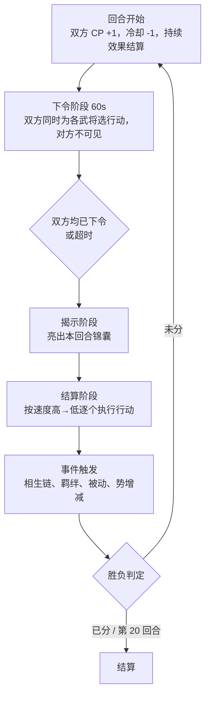
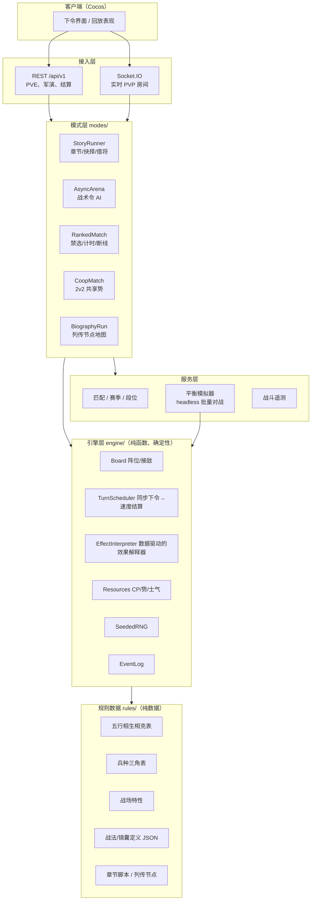

# 《十三州》战斗玩法设计 v3 ——「军令·势」战斗系统

## 文档信息

| 项 | 内容 |
|---|---|
| 版本 | v3.0 草稿 |
| 状态 | 评审中 |
| 范围 | 核心战斗规则、PVE 剧情框架、PVP 结构、战斗引擎分层架构 |
| 不覆盖 | 玩法入口清单（副本/爬塔/公会战等见 `BATTLE_MODES_DESIGN.md`）、卡牌成长数值（见 `GAME_DESIGN.md`）、界面稿（见 Cocos 客户端 `SCENES.md`） |
| 与现有代码的关系 | 在 `battle_engine.py` v2（速度行动序、五行克制、暴击、冷却、Buff）之上扩展为 v3，不推翻 |

---

## 一、背景与目标

### 1.1 问题陈述

现有战斗（`app/utils/pve_battle.py`、`app/battle_engine.py`）的本质是：双方按速度轮流**随机**选目标普攻，服务端一次算完整场，客户端回放。这带来三个结构性问题：

1. **没有决策点**。玩家在战斗内唯一的输入是"点开战"，胜负在编队时就已决定。战斗只是结算动画，不可能"耐玩"。
2. **平衡只能靠数值**。没有位置、没有克制以外的博弈维度，一张卡强就是全面强，不存在"这张卡怕什么"，压制只能靠削数值，meta 会僵死在最高战力组合上。
3. **无法承载剧情**。草船借箭、空城计、火烧赤壁这些名场面本质是"特殊规则下的战斗"，而现有引擎只有一种规则，剧情只能做成战斗前后的文字。

### 1.2 目标用户

- **核心**：25–40 岁、熟悉三国故事、有卡牌/策略游戏经验的男性玩家。要的是"我比对手更会算"的满足感，而不是数值碾压。
- **次核心**：三国 IP 爱好者，冲着剧情和武将来，战斗要能看懂、能上手，但不要求深钻。
- **付费用户**：愿为武将、皮肤、通行证付费，但要求 PVP 有"公平场"可打，否则流失。

### 1.3 设计目标与成功指标

| 目标 | 指标 | 目标值 |
|---|---|---|
| 耐玩 | 单场 PVP 平均决策次数 | ≥ 25 次（每回合 3–5 个可选行动 × 6–8 回合） |
| 耐玩 | 30 日留存 | ≥ 25% |
| 平衡 | 天梯前 200 名使用武将种类 | ≥ 60% 的可用武将出场 |
| 平衡 | 任一武将天梯胜率 | 45%–55% |
| 发挥智慧 | 同战力对局中"低战力方"胜率 | ≥ 35%（现状约 5%） |
| 剧情 | 主线九章完成率（进入过第一章的玩家） | ≥ 40% |
| PVP 体验 | 单场时长 | 6–10 分钟 |
| 架构 | 新增一个技能/锦囊/关卡机制 | 无需改引擎核心代码 |

---

## 二、市面玩法借鉴

不是抄哪一款，而是各取一个被验证过的**决策机制**，组合成适合三国题材的整体。

| 来源 | 借鉴的机制 | 它解决什么 | 在本方案中的落地 |
|---|---|---|---|
| 《三国杀》/《Marvel Snap》 | **隐藏信息 + 同步下令** | 猜对手在做什么，是策略游戏最便宜的深度来源 | 双方每回合**同时秘密下令**，按速度结算；锦囊是暗牌 |
| 《炉石传说》 | **资源曲线**（法力逐回合增长） | 前期小招、后期大招的节奏感；"存还是花"的每回合抉择 | 军令点（CP）每回合 +1，上限 6，未用的最多存 2 |
| 《火焰纹章》/《曹操传》 | **兵种三角 + 阵型位置** | 用简单规则制造"这张卡怕什么" | 骑克弓、弓克步、步克骑；前/中/后三列阵位有实际意义 |
| 《率土之滨》/《三国志·战略版》 | **战法系统、军师** | 武将不只是数值，"带什么战法"本身是构筑 | 每将 1 主动 1 被动 + 可配 1 副战法；军师锦囊 3 张出战 |
| 《原神》元素反应 | **元素之间有相互作用而非单纯克制** | 让配队有"化学反应"，不只是堆强卡 | 五行**相生**：木生火、火生土……触发增益链；相克管伤害，相生管配合 |
| 《云顶之弈》/《金铲铲》 | **羁绊** | 让弱卡因为组合而有价值，压平强弱差 | 复用客户端已实现的羁绊（桃园结义/虎豹骑等），在引擎内生效 |
| 《杀戮尖塔》 | **肉鸽地图 + 事件** | 单人 RPG 的重复可玩性 | 番外「列传」用节点地图：事件/战斗/歇脚/商贾 |
| 《明日方舟》 | **手工关卡机制** | 每一关有独特规则，而不是数值递增 | 名场面关卡各带专属规则（草船借箭是生存关，空城计是纯锦囊关） |
| 《炉石》/ 格斗游戏 | **翻盘机制** | 落后方不能毫无希望 | 「势」条：处于劣势时积累更快，攒满放合击 |
| 《英雄联盟》 | **禁选 + 赛季 + 数据调整** | meta 不僵死 | 排位禁将、赛季规则变动、每月「调整令」公示 |

从中提炼出四条设计原则，后面所有规则都要过这四关：

1. **每回合都有真选择**：至少两个合理选项，且没有"永远正确"的那个。
2. **每张卡都有克星**：任何强度都要有对应的反制路径，反制成本要低于被克成本。
3. **信息不对称但可推理**：对手意图不可见，但线索可见（手上 CP、冷却、势条、锦囊数）。
4. **规则少、组合多**：新增内容靠数据配置组合出来，不靠新规则堆砌。

---

## 三、核心战斗规则 ——「军令·势」

### 3.1 战场

- **3 列 × 2 位** 阵型，每方 6 个阵位：前军 / 中军 / 后军各 2 位。**与客户端编伍页已实现的布局一致**，不新增界面概念。
- **接敌规则**：近战（骑/步）只能攻击对方**最靠前的非空列**；远程（弓/谋）可打任意列，但打后军伤害 −20%；医/辅不参与主动攻击。
- **前军倒下则中军顶上**：位置动态前移，玩家可用「换位」行动主动调整（消耗 1 CP）。
- **战场特性**：每张地图/关卡带 1–2 条全局规则（见 3.7），进战场前双方可见。

### 3.2 回合结构：同步秘密下令



- **下令**：为每名存活武将选一个行动：普攻（免费）/ 主动战法（耗 CP）/ 换位（1 CP）/ 蓄势（跳过，势 +8）。另可打出至多 1 张锦囊。
- **超时**：未下令的武将自动普攻；连续两回合超时视为托管。
- **结算顺序**：速度高者先动；同速比较「势」，再随机。行动目标在结算时若已阵亡，自动转向同列另一目标（不浪费行动，但也失去精准）。

这套结构的关键：**对方看不到你的指令，但看得到你的 CP、冷却和势**，于是"他这回合 CP 够放大招，我要不要先把前军换下来"这种推理每回合都在发生。

### 3.3 资源：军令点（CP）

| 项 | 规则 |
|---|---|
| 初始 | 第 1 回合 2 点 |
| 增长 | 每回合 +1，上限 6 |
| 结转 | 未用完的最多**存 2 点**到下回合（超出作废）——既奖励规划，又防止无脑囤积 |
| 消耗 | 主动战法 1–4 点；换位 1 点；锦囊 0–2 点 |
| 额外获取 | 击杀 +1；被动「奇谋」类武将有条件回 CP |

CP 是全队共享的，所以"这回合让谁放技能"本身就是取舍。

### 3.4 势与士气：节奏与翻盘

**势（Momentum）**：全队共享的 0–100 条。
- 获取：命中相克目标 +6、击杀 +15、成功挡下对方大招 +10、蓄势 +8、每回合结束时**兵力落后方额外 +5**（翻盘补偿）。
- 消耗：攒满 100 可发动「**合击**」——本回合两名武将的主动战法合并释放，伤害 ×1.5 且无视一次控制。合击是"酣畅淋漓"的核心表现节点，也是落后方翻盘的窗口。
- 势不结转到下一场。

**士气（Morale）**：每方 100 起，每损失一名武将 −20；≤40 时全队攻防 −15%；**主将阵亡额外 −30**。「鼓舞」类战法可回复。士气让"先打谁"成为真问题——集火削士气，还是稳住阵线。

### 3.5 三层克制（软克制，单层不超过 30%）

三层叠加最高约 ×1.7，最低约 ×0.5，足以逆转战力差 30% 以内的对局，但不能让 50% 战力差消失——这是"发挥智慧"和"氪金有意义"之间的刻度。

| 层 | 关系 | 倍率 | 现状 |
|---|---|---|---|
| 五行相克 | 金→木→土→水→火→金 | 克 ×1.3 / 被克 ×0.75 | `battle_engine.py` 已有，沿用 |
| 兵种三角 | 骑克弓、弓克步、步克骑；谋、医不在三角内 | ×1.2 / ×0.85 | 复用现有职业字段，新增倍率表 |
| 位置 | 远程打后军 −20%；近战打前军 +10% | 见 3.1 | 新增 |

**五行相生（新增的配合层）**：木生火、火生土、土生金、金生水、水生木。当 A 释放主动战法后，本回合内**被 A 所生的五行**的友军下一次行动获得「承势」：伤害 +15% 或治疗 +15%。连续三次相生触发「五行归元」：全队势 +20。相生不管伤害只管配合，所以它鼓励的是**多元素混编**而不是单一元素堆叠——这是和"羁绊要求同阵营"形成张力的地方，玩家必须在两者间取舍。

### 3.6 武将构成

每名武将：

- **基础四维**：武力（物理攻）、统率（防御）、智力（谋略攻/治疗量）、速度。保留现有 `attack/defense/hp/speed`，智力映射到现有 `element`/技能倍率。
- **兵种**：骑 / 步 / 弓 / 谋 / 医（对应现有 job_class 五类：骑将/武将/弓将/谋士/医者）。
- **五行**：金木水火土（现有）。
- **主动战法 ×1**（CP 消耗 + 冷却）、**被动战法 ×1**、**可装配副战法 ×1**（从战法库中习得，构筑深度来源）。
- **主将标记**：出战时指定一人为主将，主将被动强化 +10%，阵亡则士气 −30。

**战法设计约束**（写进数值表，不写进代码）：

| 类型 | CP | 冷却 | 数值锚点 |
|---|---|---|---|
| 单体爆发 | 2 | 2 | 220%–260% 武力 |
| 横排/纵列 AOE | 3 | 3 | 130%–150% 武力，2–3 目标 |
| 全体 AOE | 4 | 4 | 100%–120% |
| 控制（眩晕/沉默/嘲讽） | 2–3 | 3 | 1 回合，同一单位每回合最多受 1 次硬控 |
| 治疗/护盾 | 2 | 2 | 18%–25% 最大兵力 |
| 增益/减益 | 1–2 | 2 | ±15%–20%，2 回合 |

### 3.7 军师锦囊

- 出战前从已拥有的锦囊中**选 3 张**带入，每张一场限用一次；打出时对方不可见，揭示阶段亮牌。
- 锦囊是**反制层**：每张进攻锦囊都有对应的识破方式。

| 锦囊 | 效果 | 反制 |
|---|---|---|
| 火攻 | 对方前军全体火属性伤害，木属性目标 ×1.5 | 水行武将在场时伤害减半；「防火」锦囊无效化 |
| 连环 | 本回合对方所有单位视为同一列（AOE 全中） | 「识破」 |
| 空城 | 本回合对方所有攻击落空，但己方本回合不得攻击 | 无（本身是赌对方本回合会重拳） |
| 反间 | 对方本回合 CP 消耗翻倍 | 「识破」 |
| 借刀 | 指定敌方一名单位本回合攻击其友军 | 主将免疫 |
| 苦肉 | 己方一名单位自损 30% 兵力，全队势 +40 | 无 |
| 识破 | 抵消对方本回合一张锦囊 | — |

锦囊数量刻意少（首期 12 张），每张都有明确的克制关系图，避免变成第二套技能系统。

### 3.8 战场特性（地形/天时）

每张地图 1–2 条，进场前可见，是**剧情关卡表达机制的载体**，也是 PVP 地图差异化的来源：

| 特性 | 规则 | 典型场景 |
|---|---|---|
| 东风 | 第 3 回合起火行伤害 +30% | 赤壁 |
| 水战 | 骑兵 −25%，弓 +15% | 赤壁、濡须 |
| 狭道 | 只有前军可被攻击，中后军不可换位 | 华容道、木门道 |
| 雪夜 | 每回合速度最低者跳过行动 | 街亭 |
| 城墙 | 守方前军 +30% 统率，攻方每 2 回合势 +10 | 攻城战 |
| 平原 | 骑兵先手，速度 +20 | 官渡、长坂坡 |

### 3.9 胜负判定

- 一方全灭，或 **第 20 回合**结束：按剩余兵力百分比比较，相同则势高者胜。
- 主将阵亡**不直接判负**，只削士气——保留"斩首"战术的价值，又不让一发暴击终结比赛。

### 3.10 平衡框架

**数值预算**：同稀有度武将的（武力 + 统率 + 兵力/10 + 速度）总和固定在预算 ±10% 内，特化分配（高攻低防等）来自预算内挪移，不来自额外加点。战法强度按 3.6 的锚点表定价，超出锚点必须用冷却或 CP 补偿。

**平衡场与自由场**：
- **平衡场（排位默认）**：所有武将按 60 级 / 3 星 / 无突破 / 无装备结算，只比构筑与操作。付费影响仅限"拥有哪些武将"。
- **自由场**：带养成数值，供追求碾压感的玩家。
两场分开排行，避免"氪金无意义"与"氪金即胜利"的两头抱怨。

**平衡场固定等级怎么定**（60 与 80 的差别）：
- 对武将之间的**平衡几乎没有影响**：固定等级下所有人乘同一组系数（`growth_utils.py`：攻防每级 +5%、兵力每级 +8%）。兵力/攻击的相对比在 60 级是 5.72/3.95 ≈ 1.45，80 级是 7.32/4.95 ≈ 1.48，战斗只长约 2%，20 回合上限与势的节奏都不用重调。本方案的战法锚点全是百分比，也不存在固定数值技能在高等级掉队的问题。
- 影响的是**玩家的感知**：等级上限 100（突破后 160）。取 60，满级玩家会觉得排位里 40 级以上的投入"不算数"；取 80，轻度玩家在排位里被拉高到远超自己阵容的强度，回到自由场落差大，可能就不去自由场了。
- 所以它不是数值问题，是"取谁的中位数"的问题。**建议**：以 60 起步（新游戏上线三个月时活跃玩家的等级中位数通常在这一带），并写成**随赛季上调**的规则——每赛季 +10 直到 80，让平衡场等级跟着玩家群体走，而不是一次定死。
- 无论取几，PVE 第四至六章的难度曲线应落在同一等级附近，让玩家的"真实强度"体验和平衡场手感接近。

**动态调整**：
- 排位 **禁选**：每方禁 2 将，前 100 名玩家的禁选数据每周公示。
- 每月「**调整令**」：胜率 >56% 或 <44% 的武将必调，调整幅度单次 ≤8%，调整前公示一周。
- 引擎确定性（见第七章）让平衡组能**离线跑 1 万场模拟**验证调整，而不是上线后看数据。

**防挫败**：同一单位每回合最多受 1 次硬控；单次伤害上限为目标最大兵力的 70%；第 1 回合禁止使用 3 CP 以上战法。

---

## 四、PVE：正史线与番外

### 4.1 设计原则：尊重原著

- **结局不可改**：主线是《三国演义》的剧情，玩家改变的是**过程和评价**（几星、用了什么打法），不是历史走向。关羽在主线里一定会走麦城。
- **想改历史去番外**：「若使」线明确标注为架空，在那里可以让关羽守住荆州。两条线不混。
- **视角跟着故事走**：讨董时你是联军，官渡时你是曹操，赤壁时你是孙刘，北伐时你是蜀汉。不强行让玩家全程扮演一方，因为演义本来就不是一方的故事。

### 4.2 主线「演义」结构

九章，每章 4–6 场战役，共约 45 场。章节顺序即原著顺序：

| 章 | 名 | 视角 | 代表战役与专属机制 |
|---|---|---|---|
| 一 | 黄巾 | 刘关张 | 桃园结义（教学）、广宗（首次「主将」概念） |
| 二 | 讨董 | 联军 | 汜水关（兵种教学）、虎牢关（三英战吕布：3 v 1 Boss，吕布每回合行动两次）、凤仪亭（纯锦囊关，无战斗单位对抗） |
| 三 | 群雄 | 曹操 | 濮阳、宛城（典韦「主将阵亡但队伍不崩」的特殊士气规则）、白门楼 |
| 四 | 官渡 | 曹操 | 白马（斩首关：关羽 1 v 6，目标只有颜良）、乌巢（限时 5 回合烧粮）、官渡决战 |
| 五 | 赤壁 | 孙刘 | 长坂坡（赵云单骑，生存 8 回合并护送阿斗）、舌战群儒（纯锦囊关）、草船借箭（生存 6 回合，每受一次远程攻击「借箭」+1，集满 10 支通关）、火烧赤壁（东风特性，第 3 回合前必须布好火攻） |
| 六 | 三分 | 刘备 | 入川、定军山（黄忠速度压制）、汉中 |
| 七 | 荆州 | 关羽 | 水淹七军（水战）、走麦城（**必败关**：目标是撑满 15 回合，评价看撑了多久） |
| 八 | 夷陵北伐 | 蜀汉 | 夷陵（火攻被反制的教学）、街亭（雪夜，马谡 AI 队友会犯错）、空城计（纯锦囊）、五丈原（星落：诸葛亮每回合掉血的计时关） |
| 九 | 归晋 | 司马氏 | 高平陵、灭蜀、灭吴 |

**每场战役 = 剧情节点 + 战斗 + 评价**：
- 剧情节点用对话与 2–3 个**抉择**推进，抉择影响的是本战的战场特性或初始条件（华容道选择放走曹操：得到关羽好感与「义」评价；选择拦截：进入必败的追击战并获得「悖义」评价），**不改变后续章节**。
- 三星条件与机制绑定（草船借箭：三星 = 一人不倒 + 借满 15 支），不是"回合数 ≤ N"的套话。
- **借将**：每章提供该章视角的史实武将作为「客将」参战，玩家自己的武将以「援将」身份最多带 3 名。既保证了剧情正确（赤壁一定有周瑜），又让玩家的养成有用。

**难度**：演义（剧情向，可跳过战斗）/ 正史（标准）/ 枭雄（每关附加一条随机负面特性，奖励稀有战法）。

### 4.3 番外「列传」：个人 RPG 模式

每名天/地阶武将一条列传，是**该武将视角的肉鸽式短篇**：

- **地图**：8–12 个节点的分叉路线（借鉴《杀戮尖塔》）：战斗 / 事件（对话抉择，影响好感与临时增益）/ 歇脚（回复或强化一个战法）/ 商贾 / 精英 / 终章。
- **队伍**：主角必带，其余从"史实相关武将"中随机 3 选 1 逐节点加入（赵云列传里会遇到刘备、张飞、诸葛亮）。
- **奖励**：好感度 → 解锁武将详情页的传记与台词（客户端已有该页签）、专属皮肤、专属副战法。
- **可重复**：每次随机节点与事件，通关一次后开放「高难列传」。

### 4.4 番外「若使」：架空线

短小的假想战役（3–4 场），入口明确标注「架空·非正史」：若使关羽不失荆州、若使郭嘉在世、若使街亭不失。战斗规则与主线相同，只是初始条件与结局文本不同。这是给"我就想改历史"的玩家的出口，也保护了主线的原著尊重。

### 4.5 与已有玩法入口的关系

副本、爬塔、Boss、公会副本等按 `BATTLE_MODES_DESIGN.md` 执行，全部跑在同一套 v3 引擎上，只是各自带不同的战场特性与胜负条件，不再各写一套战斗逻辑。

---

## 五、PVP：从异步到实时

### 5.1 军演（异步，已有界面）

- 挑战对方的**防守阵容**。防守方不在线，由 AI 按其预设的「**战术令**」下令：玩家可为防守阵容设置 5 条优先级规则（"兵力低于 40% 时优先治疗""对方前军空时后军换位到前"……）。这让异步 PVP 也有"对手的意志"，而不是纯随机 AI。
- 每日 5 张演券，胜负按第三章规则真实结算，客户端已有的胜算展示改为**基于 1000 场离线模拟**的真实估算。

### 5.2 巅峰（实时排位）

- 1v1，双方各 6 将，**平衡场**规则（60 级 / 3 星 / 无装备）。
- **禁选**：各禁 2 将 → 轮流选 6 将（1-2-2-1 蛇形）→ 各选 3 锦囊 → 系统随机战场特性（双方可见后 15s 可各改 1 将）。
- 下令 **60s**（双方都已提交即刻结算，多数回合不会用满），总时长目标 6–10 分钟。若上线后实测平均单场超过 10 分钟，再考虑排位缩到 45s，休闲场保持 60s。
- 段位：蛰伏 / 虎视 / 雄踞 / 称霸（复用军演页已有的段位文案），赛季 8 周，赛季末重置至低一大段。
- 断线：30s 内可重连，超时按当前局面 AI 托管而非判负。

### 5.3 合击（2v2 组队）

- 两名玩家各带 3 将，共享战场（每方 3 列 × 2 位由两人各占一列 + 中军各一位）。
- **CP 各自独立、势共享**：合击（100 势）需要两人在同一回合各出一名武将，是组队模式的核心配合点。
- 队友的下令在揭示阶段前**对队友可见**、对敌方不可见，鼓励语音配合但不强制。
- 用于「盟战」与「好友对战」。

### 5.4 让 PVP "酣畅淋漓" 的具体手段

| 手段 | 目的 |
|---|---|
| 势条与合击 | 每 3–4 回合出现一次全屏级表现节点 |
| 落后方势加成 | 保证第 5 回合前不会"看结果" |
| 20 回合上限 + 兵力判定 | 杜绝龟缩拖延 |
| 硬控上限、伤害上限 | 不会一回合被秒或被控死 |
| 结算后**揭示对手全部指令与锦囊** | 复盘是策略游戏的第二次爽点 |
| 战报可回放、可分享 | 借助引擎确定性（第七章），一个种子 + 指令序列即可重放 |

---

## 六、用户故事（节选）

**As a** 策略玩家, **I want to** 在战斗中每回合做出选择并猜测对手意图, **So that** 我能用操作赢下战力更高的对手。
- Given 双方战力差 20% 以内 / When 低战力方正确预判并用「空城」躲过对方合击 / Then 低战力方有机会在势条领先后翻盘。

**As a** 三国爱好者, **I want to** 按原著顺序经历名场面且结局不被篡改, **So that** 我玩到的是我熟悉的三国。
- Given 玩家进入第七章走麦城 / When 战斗结束 / Then 无论表现如何关羽都会阵亡，评价按撑过的回合数给星。

**As a** 想改历史的玩家, **I want to** 有一个明确标注的架空模式, **So that** 我可以让关羽守住荆州而不影响主线。

**As a** 排位玩家, **I want to** 有不看养成只看操作的对局, **So that** 我不会因为没氪金而永远打不过。
- Given 平衡场 / When 双方进入战斗 / Then 所有武将按 60 级 3 星无装备结算。

**As a** 策划, **I want to** 新增一个战法只改配置, **So that** 每月调整令不需要排开发。
- Given 战法以数据定义 / When 策划提交新 JSON / Then 引擎无需改代码即可加载并生效。

---

## 七、软件架构：分层、确定性、数据驱动

### 7.1 总体分层



**分层铁律**：
- 引擎层**不 import 任何 Flask、DB、网络代码**。输入是（双方阵容快照 + 规则数据 + 种子），每回合输入指令，输出事件列表。
- 模式层负责"什么时候要指令、指令从哪来（玩家/AI/脚本）、结果写到哪"。
- 规则数据全是 JSON/表，策划可改，引擎按 schema 加载并校验。

### 7.2 引擎核心接口

```python
class BattleEngine:
    def __init__(self, setup: BattleSetup, rules: RuleSet, seed: int): ...
    def begin_round(self) -> RoundInfo            # CP/冷却/持续效果结算，返回双方可见信息
    def submit_orders(self, side: Side, orders: Orders) -> None
    def resolve_round(self) -> list[BattleEvent]  # 双方都已提交后调用，产生该回合全部事件
    def is_over(self) -> Optional[BattleOutcome]
    def snapshot(self) -> BattleState             # 可序列化，用于断线重连与回放
```

`Orders` = 每名武将一个行动 + 至多一张锦囊。`BattleEvent` 是**唯一**对外输出，客户端只依赖事件（已有的 Cocos 回放正是按事件驱动的，v3 只是事件种类变多）。

### 7.3 确定性与回放

- 引擎内所有随机数来自 `SeededRNG(seed)`；相同（设置 + 种子 + 指令序列）必得相同结果。
- 由此获得：
  - **回放/观战**：存种子 + 指令，不存事件流，体积小。
  - **断线重连**：重放到当前回合即可恢复。
  - **反作弊**：服务端权威，客户端不跑引擎；赛后公开种子，玩家可自行验证。
  - **平衡模拟**：`BalanceSimulator` 用不同种子跑 1 万场，产出胜率/出场率报表，调整令依据它而不是线上数据的滞后反馈。

### 7.4 数据驱动的效果系统（扩展性的核心）

战法、锦囊、被动、战场特性、剧情关卡机制**全部**是同一种数据结构：

```json
{
  "id": "skill_zhaoyun_qijin",
  "name": "七进七出",
  "cost": 3, "cooldown": 3,
  "trigger": "on_cast",
  "target": { "select": "enemy", "scope": "column_front", "max": 2 },
  "effects": [
    { "op": "damage", "scale": "attack", "mult": 1.4, "element": "inherit" },
    { "op": "move_self", "to": "front" },
    { "op": "gain", "resource": "momentum", "value": 10, "if": "any_target_killed" }
  ]
}
```

- `op` 是引擎内置的**约 20 个原子操作**（damage / heal / shield / buff / debuff / control / move / gain / swap_column / reveal / cancel_stratagem …）。
- 新战法 = 新 JSON；新机制若现有原子不够，才在 `EffectInterpreter` 里加一个 `op`，加完后所有内容都能用。
- 剧情关卡的"草船借箭"就是一条战场特性：`trigger: on_hit_by_ranged` → `gain counter:arrows +1`，胜负条件 `counter:arrows >= 10`。**关卡机制和战法用同一套解释器**，这是"新增关卡不改引擎"的保证。

### 7.5 AI 分层

| 层 | 用途 | 实现 |
|---|---|---|
| 脚本 AI | 剧情关（马谡会犯错、吕布必攻主将） | 关卡 JSON 里的行为脚本 |
| 战术令 AI | 军演防守方 | 玩家配置的优先级规则解释器 |
| 启发式 AI | PVE 通用敌军、托管 | 评估函数：克制、集火、保主将 |
| 搜索 AI | 枭雄难度、平衡模拟器的"强对手" | 单回合前瞻 + 蒙特卡洛，深度可配 |

四层用同一个 `OrderPlanner` 接口，模式层只管拿指令，不关心指令怎么来的。

### 7.6 与现有代码的迁移路径

| 现有 | 处置 |
|---|---|
| `battle_engine.py` v2 的五行克制、暴击、Buff、冷却 | 迁入 `engine/`，作为 v3 的结算子模块，公式保留 |
| `pve_battle.py` 的一次算完 | 包装成 `StoryRunner` 在"全自动托管"模式下的调用（双方 AI 下令 + 循环 resolve），**保留自动战斗**给不想操作的玩家 |
| `/api/v1/pve/battle/start` 及客户端回放 | 事件 schema 向后兼容：保留 `attack/damage/message`，新增 `cast/stratagem/momentum/morale/move` 等事件类型，客户端逐步接入 |
| 客户端编伍页的 3×2 阵位、羁绊 | 直接成为 v3 的阵型输入与羁绊规则数据 |
| 军演页本地掷骰 | 改为调用真实引擎的异步对战接口 |
| Flask-SocketIO（已引入未用） | 承载实时排位房间 |

### 7.7 目录结构（后端）

```
app/
├── engine/            # 纯引擎，无框架依赖，可独立单测与批量模拟
│   ├── board.py       # 阵位、接敌、换位
│   ├── scheduler.py   # 回合流程、速度排序
│   ├── resources.py   # CP / 势 / 士气
│   ├── effects.py     # EffectInterpreter + 原子 op
│   ├── rng.py         # SeededRNG
│   ├── events.py      # BattleEvent 定义与序列化
│   └── engine.py      # BattleEngine 门面
├── rules/             # JSON 与加载/校验器
│   ├── elements.json  # 相生相克
│   ├── units.json     # 兵种三角
│   ├── terrains.json  # 战场特性
│   ├── skills/        # 战法
│   ├── stratagems/    # 锦囊
│   └── story/         # 章节脚本、列传节点
├── modes/             # StoryRunner / AsyncArena / RankedMatch / CoopMatch / BiographyRun
├── ai/                # OrderPlanner 及四种实现
├── services/          # 匹配、赛季、平衡模拟器、遥测
└── routes/            # 现有 REST + 新增 Socket.IO 事件
```

---

## 八、数据与接口（关键部分）

### 8.1 指令（客户端 → 服务端）

```json
{
  "round": 4,
  "orders": [
    { "unit": "uc_1023", "action": "skill", "skill": "skill_zhaoyun_qijin", "target": "enemy_col_front" },
    { "unit": "uc_1031", "action": "attack", "target": "e_3" },
    { "unit": "uc_1044", "action": "swap", "to": "front" },
    { "unit": "uc_1050", "action": "charge" }
  ],
  "stratagem": "strat_fire"
}
```

### 8.2 事件（服务端 → 客户端，回放唯一依据）

| type | 字段 | 说明 |
|---|---|---|
| `round_start` | round, cp:{a,b}, momentum:{a,b}, morale:{a,b} | 回合开始快照 |
| `reveal` | side, stratagem | 揭示锦囊 |
| `cast` | actor, skill, targets[] | 战法释放 |
| `damage` | actor, target, value, crit, element_mult, unit_mult, position_mult | 每一跳伤害，倍率拆开给复盘用 |
| `heal` / `shield` / `buff` / `debuff` / `control` | target, value/effect, duration | 状态类 |
| `move` | unit, from, to | 换位或前移 |
| `momentum` / `morale` | side, delta, reason | 势/士气变动 |
| `combo` | side, units[] | 合击 |
| `death` | unit | 阵亡 |
| `stratagem_cancelled` | side, by | 被识破 |
| `end` | winner, reason, stars, stats | 结算 |

单位一律用**唯一 id**（`uc_*` / `e_*`），不再用姓名——现有战报按姓名标识、同名小兵无法区分的问题在 v3 消除。

### 8.3 接口

| 接口 | 用途 |
|---|---|
| `POST /api/v1/battle/pve/start` | 建局（关卡 + 阵容 + 锦囊 + 难度），返回 battle_id、种子、初始快照、战场特性 |
| `POST /api/v1/battle/{id}/orders` | 提交本回合指令（PVE 对手由 AI 立即下令并结算，返回事件） |
| `POST /api/v1/battle/{id}/auto` | 托管：服务端自动跑完剩余回合 |
| `GET  /api/v1/battle/{id}/replay` | 种子 + 指令序列 |
| Socket.IO `ranked.*` | 匹配、禁选、下令、事件推送、重连 |

### 8.4 错误与异常

| 场景 | 处理 |
|---|---|
| 指令非法（CP 不足、目标不可达、冷却中） | 整包拒绝并返回具体项，客户端不允许提交非法指令，服务端仍校验 |
| 下令超时 | 未下令单位普攻；连续两回合托管，可手动取消 |
| 实时对局断线 | 30s 内重连恢复，超时 AI 托管到局末 |
| 服务端对局状态丢失 | 由种子 + 已提交指令重放恢复 |
| 规则 JSON 校验失败 | 启动即拒绝加载并报明文件与字段，不带病上线 |

---

## 九、非功能需求

- **性能**：引擎单回合结算 ≤ 20ms（Python），实时对局每回合服务端处理 ≤ 100ms；平衡模拟 1 万场 ≤ 10 分钟（可多进程）。
- **安全**：服务端权威；客户端只提交指令；种子赛后公开；所有数值来自服务端事件。
- **确定性**：引擎单测包含"固定种子 + 固定指令 → 固定事件哈希"的回归用例。
- **兼容**：事件 schema 带版本号；旧客户端未知事件类型直接忽略。
- **可观测**：每场记录 hero pick / win / 平均回合 / 锦囊使用率，喂给调整令。

---

## 十、边界与限制

**本期不做**：3D 战斗表现、实时动作操作、跨服赛、观战直播、自定义战法编辑器（策划工具另立项）。

**技术约束**：后端保持 Python/Flask；引擎不引入 Node 等第二运行时；客户端不跑引擎。

**依赖**：
- 关卡敌军配置需先完成 `card_id` 修复（`fix_stage_enemy_config.py`），否则剧情关无敌军。
- 战法库首期至少 40 条、锦囊 12 张、战场特性 8 条，内容量由策划排期。
- 实时 PVP 依赖 Socket.IO 部署（gunicorn 需 eventlet/gevent worker，见 `DEPLOYMENT.md`）。

---

## 十一、路线图（RICE 排序后）

| 阶段 | 内容 | 依据 |
|---|---|---|
| **P0（引擎 + 剧情前三章）** | `engine/` 与规则数据；同步下令 / CP / 势 / 士气 / 三层克制 / 相生；PVE 主线第一至三章（含虎牢关、凤仪亭专属机制）；客户端下令界面与新事件回放；军演接真实引擎 + 战术令 | 覆盖全部用户，是其余一切的前提；Effort 最大但 Confidence 最高（规则已定、现有代码可迁） |
| **P1（PVP 与内容）** | 实时排位（禁选、平衡场、段位、赛季）；锦囊系统；主线四至六章；列传 ×3；平衡模拟器与首份调整令 | PVP 是留存主力；模拟器让平衡工作可持续 |
| **P2（深度）** | 2v2 合击；主线七至九章；「若使」×3；列传全量；枭雄难度与搜索 AI；回放分享 | 面向核心玩家，Reach 较小但决定长期口碑 |

---

## 十二、开放问题

| 问题 | 负责人 | 截止 |
|---|---|---|
| 平衡场固定等级：建议 60 起步、随赛季 +10 至 80（依据见 3.10），待商业化确认起步值 | 策划 + 商业化 | P1 启动前 |
| 走麦城等「必败关」的评价文案与奖励，避免被理解为惩罚 | 文案 | 第七章排期前 |
| 实时对局 Socket.IO 在国内网络下的重连成功率基线 | 后端 | P1 技术预研 |
| 借将的养成数值是否随章节固定，与玩家援将的强度差如何控制 | 数值 | P0 第二章前 |
| 战法副技能的获取渠道（列传掉落 / 商店 / 通行证）与稀缺度 | 商业化 | P1 |

---

## 附录 A：数值锚点（供数值表初始化）

| 项 | 值 |
|---|---|
| 五行相克 | ×1.30 / ×0.75 |
| 兵种三角 | ×1.20 / ×0.85 |
| 位置 | 近战打前军 ×1.10；远程打后军 ×0.80 |
| 相生「承势」 | 伤害/治疗 +15%，单回合一次 |
| CP | 首回合 2，每回合 +1，上限 6，结转 ≤ 2 |
| 势 | 相克命中 +6，击杀 +15，挡大招 +10，蓄势 +8，落后方每回合 +5，满 100 合击 ×1.5 |
| 士气 | 100 起，失将 −20，主将 −30，≤40 全队 −15% |
| 上限 | 20 回合；单次伤害 ≤ 目标最大兵力 70%；每单位每回合硬控 ≤ 1 |
| 暴击 | 沿用 v2：基础 10%，×1.5 |
| 稀有度预算（60 级） | 黄 1.00 / 玄 1.15 / 地 1.32 / 天 1.50（相对值，平衡场用） |
